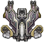
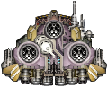
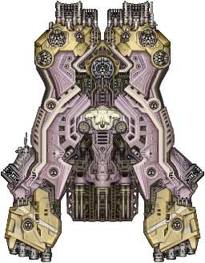

# It Came From Beyond

*It Came From Beyond* is a work-in-progress mod for the game [Starsector](https://fractalsoftworks.com). It aims to add
additional content and mechanics to the game.

## Requires

[LazyLib](https://fractalsoftworks.com/forum/index.php?topic=5444.0), [MagicLib](https://fractalsoftworks.com/forum/index.php?topic=25868.0).

## Features

- ***New campaign factions***
  - The Boundless: A group of humans that arrived from a distant sector via a unique form of faster-than-light travel
  called a "Shift Drive". [DONE!]
  - Shifters: ***REDACTED*** [UNFINISHED]
- ***New spaceships***
  - Four new playable frigates. [UNFINISHED]
    - Kaldur-class corvette
    - Hrafn-class frigate [WIP]
  
    
    - Froskur-class frigate [DONE!]

    
    - Skjoldr-class heavy frigate [WIP]

    
  - Three new playable destroyers. [UNFINISHED]
    - Karta-class destroyer [DONE!]

    
    - Vik-class destroyer
    - Hrim-class light carrier
  - Two new playable cruisers. [UNFINISHED]
    - Vindur-class cruiser
    - Ormr-class cruiser
  - Two new playable capital ships. [UNFINISHED]
    - Hakarl-class battlecruiser [DONE!]

    
    - Dreki-class battleship
  - Several new utility and logistical ships. [UNFINISHED]
    - Vagn-class combat freighter (frigate)
    - Saehest-class light freighter (frigate)
    - Flutningur-class combat freighter (destroyer)
    - Hval-class freighter (cruiser)
    - Straum-class light tanker (frigate)
    - Fjor-class tanker (cruiser)
  - Several unboardable ***REDACTED*** ships. [UNFINISHED]
- ***New player fleet abilities***
  - Shift Jump: Allows instantaneous travel across the sector
  for a large cost. Massively lowers the combat readiness of the player's fleet, and consumes copius fuel. Using it too
  often may also attract some "unwanted" attention. [PARTIALLY IMPLEMENTED]
- ***New Story***
  - [UNFINISHED]

## Faction Lore

The Boundless are an enigmatic faction that formed as an officially recognized polity just a few dozen cycles ago. The majority of their leadership and high-class citizenry are survivors who arrived in the sector aboard a massive generational ship called 'The Wings of Enteria'. According to witnesses and researchers, it appeared suddenly, and with a flash of energy violent enough to shatter a nearby moon. Boundless officials constantly try to downplay these very provable claims, but it's difficult to determine their purpose in doing so. Their laws, regulations, and political practices boarder on the edge of paranoia.

In terms of governance, the Boundless maintain a centralized, authoritarian regime with an emphasis on information management. Their citizens are monitored closely, with regular loyalty screenings and strict enforcement of laws to ensure compliance. Dissent is not tolerated, and those who question the state often disappear under mysterious circumstances. However, this rigid system has its benefits: the Boundless are highly organized, efficient, and capable of mobilizing their fleets with little notice. Their military is designed around strategic defense and calculated offense, and their leaders are often pragmatic to a fault.

Despite their harsh internal policies, the Boundless are not overtly expansionist, at least not yet. Instead, they prefer to engage in strategic alliances and trade agreements, often acquiring resources or technology through less aggressive means. However, their motives remain opaque, and many factions - especially the Hegemony and the League - keep a wary eye on them, unsure whether the Boundless are merely biding their time before revealing their true intentions. Those who have interacted with them directly report a strange duality: they seem both terrified of the unknown and utterly driven by it, as if their journey through the void has fundamentally altered their perception of what it means to survive in the universe.

## Credits

- JohnShmo (Author)
- [LazyLib](https://fractalsoftworks.com/forum/index.php?topic=5444.0) by *LazyWizard*.
- [MagicLib](https://fractalsoftworks.com/forum/index.php?topic=25868.0) by *Tartiflette*, *Wisp*, and others.
